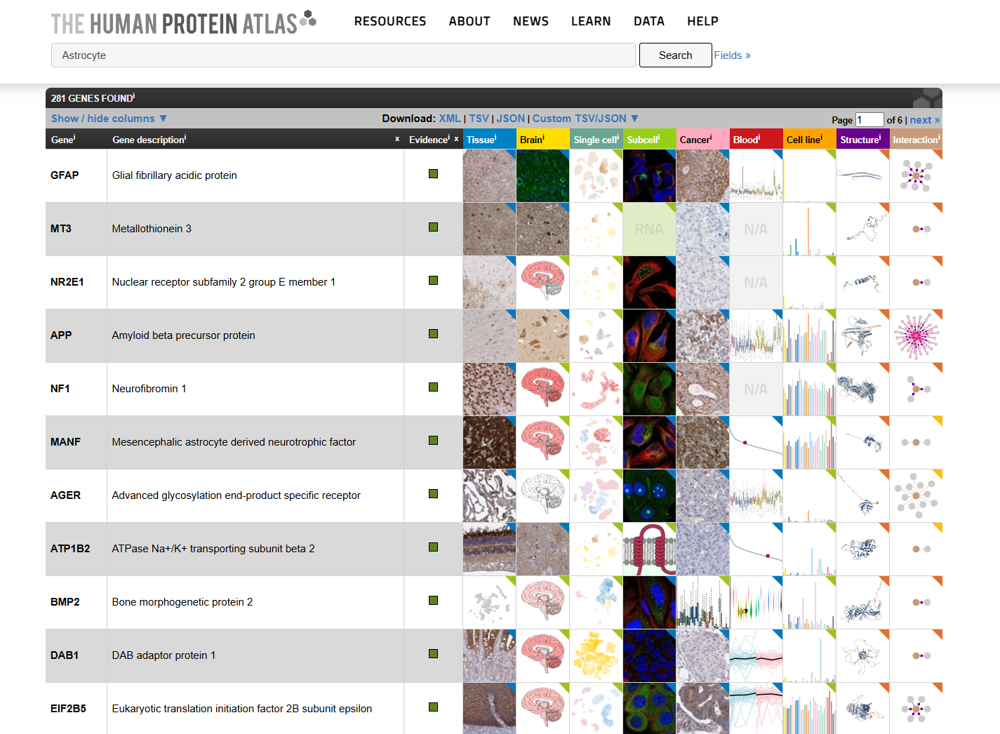
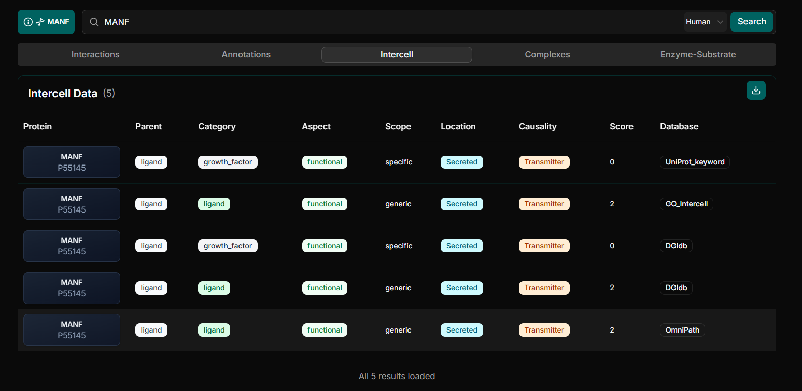
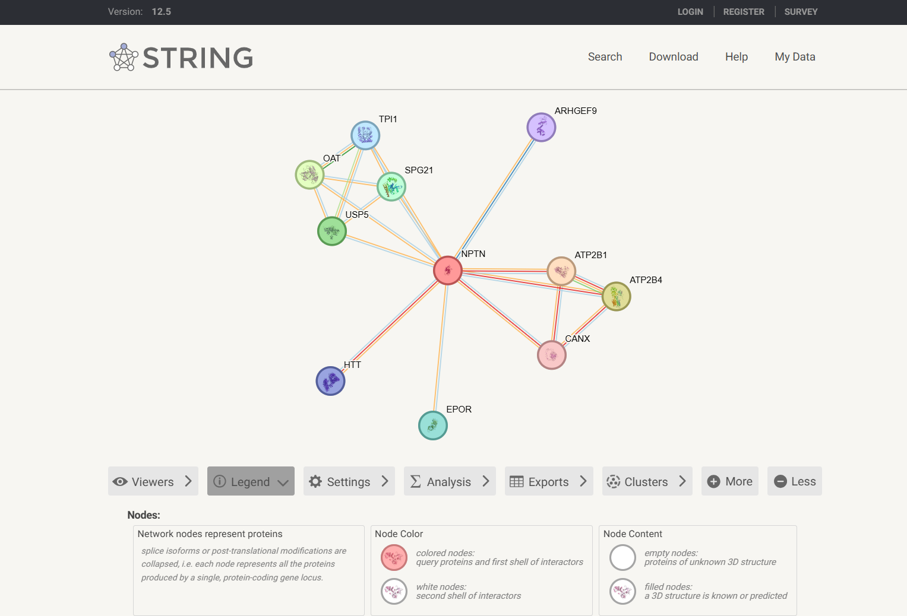
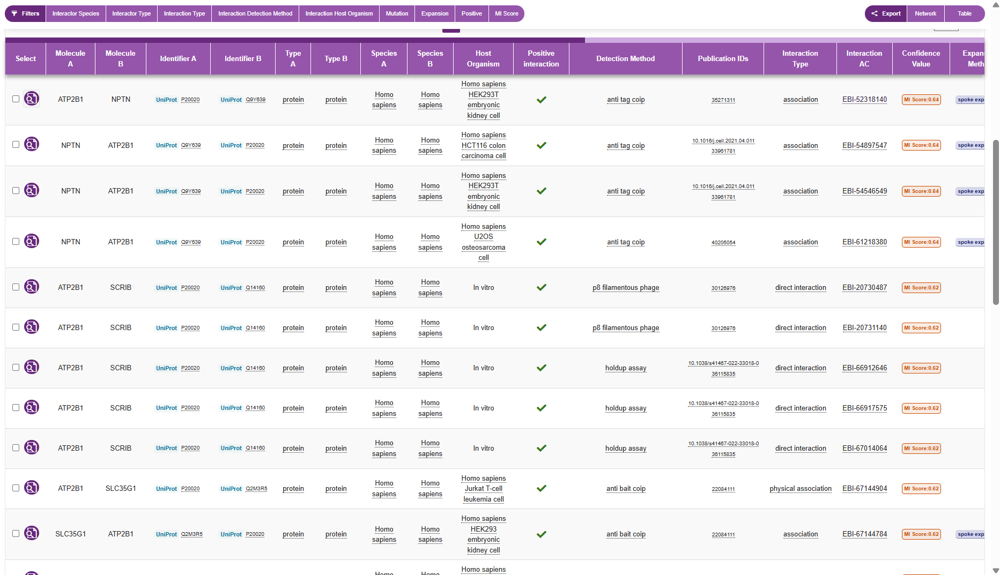
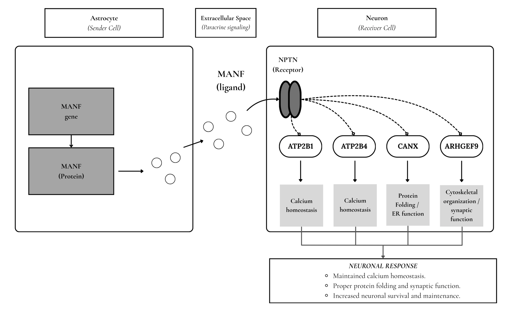

# Astrocyte–Neuron Communication: A Bioinformatics Investigation of MANF–NPTN Signaling

*A proposed paracrine signaling model integrating evidence from the Human Protein Atlas, OmniPath, STRING, and IntAct.*

---

## Overview

Cell-to-cell communication is essential for coordinating cellular activities and maintaining physiological homeostasis. In the central nervous system, astrocytes and neurons communicate through signaling molecules that contribute to neuronal maintenance, synaptic regulation, and cellular responses to stress.

This investigation explores the potential involvement of mesencephalic astrocyte-derived neurotrophic factor (MANF) and neuroplastin (NPTN) in astrocyte-to-neuron communication.

**Biological Question:** How might astrocyte-derived MANF interact with neuronal NPTN and influence cellular processes associated with neuronal maintenance and function?

The proposed signaling system consists of:

- **Sender cell:** Astrocyte
- **Signaling ligand:** MANF
- **Proposed receptor:** NPTN (Neuroplastin)
- **Receiver cell:** Neuron
- **Communication type:** Paracrine signaling
- **Proposed response:** Neuronal homeostasis, synaptic function, and cellular maintenance

---

## Astrocytes as the Signaling Source

**Astrocyte** was selected as the *sender cell* for this investigation and was officially recorded in the designated Google Sheets spreadsheet as the chosen cell type for the cell-to-cell communication analysis.

Astrocytes are specialized glial cells in the central nervous system that provide structural and metabolic support to neurons. They contribute to neurotransmitter regulation, extracellular ion balance, synaptic activity, and cellular responses to stress.

Their ability to produce signaling molecules makes them suitable candidates for investigating paracrine communication with neighboring neurons.

The Human Protein Atlas was used to examine astrocyte-associated genes and investigate the expression of the selected signaling molecule.

**Figure 1.** Human Protein Atlas search results for astrocyte-associated genes.

### MANF Expression in Astrocytes

Mesencephalic astrocyte-derived neurotrophic factor (MANF) was selected as the candidate signaling ligand because of its reported involvement in cellular stress responses and neuroprotective processes.

Human Protein Atlas Single Nuclei Brain expression data showed detectable MANF RNA expression in astrocytes, approximately 9 nCPM in the examined visualization.

This observation supports the possibility that astrocytes produce MANF. However, RNA expression alone does not confirm protein secretion under specific physiological conditions.

---

## Neuroplastin as a Candidate Neuronal Receptor

**Neuroplastin (NPTN)** was selected as the *proposed receptor*, while **neurons** were identified as the *potential receiver cells*.

NPTN is a transmembrane protein associated with neuronal functions and interactions involving other membrane proteins.

Human Protein Atlas Single Nuclei Brain expression data showed substantial NPTN RNA expression across multiple neuronal populations, supporting the selection of neurons as potential receiver cells.

Furthermore, Yagi et al. (2020) investigated the interaction between MANF and neuroplastin in relation to the anti-inflammatory effects of MANF.

These findings support the biological plausibility of a proposed MANF–NPTN signaling relationship, although its operation between astrocytes and neurons remains to be experimentally confirmed.

---

## Intercellular Signaling Annotations from OmniPath

OmniPath was used to examine the intercellular signaling roles of MANF and NPTN.

### MANF Annotations

The database identified MANF with the following classifications:

- **Parent:** Ligand
- **Category:** Ligand, Growth factor
- **Aspect:** Functional
- **Location:** Secreted
- **Causality:** Transmitter

### NPTN Annotations

NPTN was associated with the following classifications:

- **Parent:** Receptor
- **Category:** Receptor
- **Aspect:** Functional
- **Location:** Transmembrane
- **Causality:** Receiver

These annotations support the proposed roles of MANF as an extracellular signaling *ligand* and NPTN as a candidate *receptor*.

However, these classifications do not independently establish a direct MANF–NPTN interaction in astrocyte-to-neuron communication.

**Figure 2.** OmniPath intercellular annotations identifying MANF as a secreted ligand and transmitter.

---

## Functional Protein Association Network

The STRING database was used to investigate proteins functionally associated with NPTN in *Homo sapiens*.

The generated receptor-centered network contained 11 proteins:

- NPTN
- ATP2B1
- ATP2B4
- CANX
- EPOR
- HTT
- ARHGEF9
- TPI1
- OAT
- USP5
- SPG21

Four proteins were selected as candidates relevant to the proposed neuronal response.

| Protein | Biological Function | Potential Relevance |
|---|---|---|
| ATP2B1 | Plasma membrane calcium transport | Intracellular calcium homeostasis |
| ATP2B4 | Calcium transport and regulation | Neuronal calcium balance |
| CANX | Endoplasmic reticulum protein folding | Protein quality control |
| ARHGEF9 | Regulation of inhibitory synapse organization | Synaptic function |

### Functional Enrichment Analysis

STRING functional enrichment identified **Presynapse (GO:0098793)** as a significantly enriched cellular component.

- **Category:** Gene Ontology - Cellular Component
- **GO identifier:** GO:0098793
- **Description:** Presynapse
- **Proteins represented:** 6 of 11
- **Strength:** 1.22
- **False discovery rate (FDR):** 0.00088

The enrichment suggests that several proteins in the NPTN-centered network are associated with neuronal structures involved in synaptic communication.

STRING connections represent functional associations and do not necessarily demonstrate direct physical interactions or confirmed downstream signaling events.

**Figure 3.** STRING protein-association network centered on NPTN in *Homo sapiens*.

---

## Experimental Interaction Evidence from IntAct

The IntAct molecular interaction database was examined to investigate experimentally reported molecular interactions involving NPTN.

The selected protein pair was **NPTN and ATP2B1**, both of which appeared in the STRING network.

### Interaction Evidence

| Parameter | IntAct Finding |
|---|---|
| Protein pair | NPTN and ATP2B1 |
| Organism | *Homo sapiens* |
| Interaction classification | Association |
| Experimental method | Anti-tag coimmunoprecipitation |
| Experimental host | HEK293T cells |
| IntAct accession | EBI-52318140 |
| Publication | Cho et al. (2022) |
| PubMed ID | 35271311 |

The curated IntAct record provides experimental evidence of a molecular association involving NPTN and ATP2B1. However, anti-tag coimmunoprecipitation can detect proteins associated within a larger molecular complex. Therefore, this result does not establish direct physical binding between NPTN and ATP2B1. Moreso, the interaction does not demonstrate that ATP2B1 acts immediately downstream of NPTN following MANF stimulation.

**Figure 4.** IntAct protein interaction network showing NPTN and its associated molecular interaction partners.

The exported IntAct interaction records are available in [interaction_summary.csv](data/interaction_summary.csv).

---

## Proposed Model of Astrocyte–Neuron Communication

The integrated database findings were used to develop a hypothetical paracrine signaling model.

**Proposed information flow:**

Astrocyte → MANF secretion → Extracellular space → NPTN on neuron → Candidate associated proteins → Potential neuronal response

The candidate proteins ATP2B1, ATP2B4, CANX, and ARHGEF9 are included based on their functional associations with NPTN and their biological roles in calcium regulation, protein maintenance, and synaptic organization. These proteins may play a role in the proposed model, but their exact signaling sequence has not been experimentally confirmed. 

**Figure 5.** Proposed model of paracrine communication between an astrocyte and a neuron through MANF–NPTN signaling and candidate associated proteins.

### Biological Interpretation

The proposed model illustrates paracrine signaling between astrocytes and neurons through MANF and NPTN. Evidence from the Human Protein Atlas showed MANF expression in astrocytes and NPTN expression in neuronal populations, supporting their selection as the sender and receiver cells. OmniPath further identified MANF as a secreted ligand and NPTN as a receptor, suggesting their possible involvement in intercellular communication.

STRING analysis revealed several proteins functionally associated with NPTN, including ATP2B1, ATP2B4, CANX, and ARHGEF9. ATP2B1 and ATP2B4 regulate calcium homeostasis, CANX supports protein folding in the endoplasmic reticulum, and ARHGEF9 contributes to synaptic organization. Functional enrichment also identified the presynapse (GO:0098793) as a significantly enriched cellular component (FDR = 0.00088), highlighting the network's relevance to neuronal function.

Furthermore, IntAct provided experimental evidence of an association involving NPTN and ATP2B1, detected through anti-tag coimmunoprecipitation and reported by Cho et al. (2022). However, this evidence does not establish direct physical binding or confirm a downstream signaling sequence. Overall, the model suggests that astrocyte-derived MANF may interact with neuronal NPTN and potentially influence calcium regulation, protein maintenance, and synaptic function, thereby supporting neuronal survival and homeostasis. Further experimental validation is necessary to confirm these proposed signaling relationships.

---

## Synthesis of Findings

### 1. What sender cell did you choose, and in what tissue or biological context does it act?

The selected sender cell was the **astrocyte**, a specialized glial cell found in the central nervous system. Astrocytes support neuronal function, maintain cellular homeostasis, regulate synaptic activity, and participate in responses to cellular stress.

### 2. What signaling molecule did you identify, and what evidence supports its production or presentation by the sender cell?

The identified signaling molecule was **mesencephalic astrocyte-derived neurotrophic factor (MANF)**. Human Protein Atlas data showed detectable MANF RNA expression in astrocytes, approximately 9 nCPM. OmniPath also classified MANF as a secreted ligand and transmitter. These findings support its potential production by astrocytes, although actual protein secretion was not directly demonstrated.

### 3. What receptor receives the signal, and which receiver cell did you select?

The proposed receptor was **neuroplastin (NPTN)**, and the selected receiver cell was the **neuron**. Human Protein Atlas data showed NPTN expression in neuronal populations, while OmniPath classified NPTN as a receptor and receiver. Yagi et al. (2020) also provided published evidence supporting a functional relationship between MANF and NPTN.

### 4. What type of cell-to-cell signaling is represented?

The proposed mechanism represents **paracrine signaling**, in which astrocyte-derived MANF is released into the extracellular environment and potentially acts on NPTN in nearby neurons.

### 5. Which proteins in your STRING network appear most relevant to the receptor-associated response? Explain briefly.

The most relevant proteins were **ATP2B1, ATP2B4, CANX, and ARHGEF9**. ATP2B1 and ATP2B4 regulate cellular calcium homeostasis, CANX participates in protein folding and quality control, and ARHGEF9 contributes to inhibitory synapse organization. Their functional associations with NPTN suggest possible involvement in neuronal maintenance and signaling.

### 6. What enriched pathway or biological process is consistent with your proposed mechanism?

STRING enrichment analysis identified **Presynapse (GO:0098793)** as a significantly enriched cellular component, involving 6 of 11 proteins, with a false discovery rate (FDR) of 0.00088. This finding is consistent with the proposed involvement of NPTN-associated proteins in neuronal and synaptic functions. However, presynapse is a cellular component rather than a biological process or signaling pathway.

### 7. What did IntAct show for the molecular interaction you examined? What type of evidence was reported?

IntAct identified an experimentally reported association between **NPTN and ATP2B1**. The interaction was detected through anti-tag coimmunoprecipitation, as reported in the OpenCell study by Cho et al. (2022). This supports an association between the proteins but does not independently establish direct physical binding or a specific downstream signaling mechanism.

### 8. Which parts of your final model are strongly supported, and which parts remain an inference?

The strongest supporting evidence includes MANF RNA expression in astrocytes, NPTN RNA expression in neurons, their OmniPath functional annotations, and the experimentally reported NPTN–ATP2B1 association. The proposed secretion of MANF by astrocytes, activation of neuronal NPTN, involvement of the selected network proteins in a sequential signaling pathway, and resulting neuronal response remain inferences requiring experimental validation.

### 9. What cellular response is expected in the receiver cell, and why?

The proposed receiver-cell response involves improved neuronal maintenance, calcium homeostasis, and regulation of synaptic function. This expectation is based on the reported protective functions of MANF and the biological roles of NPTN-associated proteins, particularly ATP2B1, ATP2B4, and ARHGEF9. However, these responses are predicted outcomes of the proposed model and were not directly demonstrated by the database analyses.

---

## References and Database Resources

EMBL-EBI. (n.d.). IntAct molecular interaction database. https://www.ebi.ac.uk/intact/ 

Human Protein Atlas. (n.d.). The Human Protein Atlas. https://www.proteinatlas.org/ 

OmniPath. (n.d.). OmniPath intercellular communication resources. https://omnipathdb.org/ 

STRING Consortium. (n.d.). STRING: Functional protein association networks. https://string-db.org/ 

Yagi, T., Asada, R., Kanekura, K., Eesmaa, A., Lindahl, M., Saarma, M., & Urano, F. (2020). Neuroplastin modulates anti-inflammatory effects of MANF. *iScience, 23*(12), Article 101810. https://doi.org/10.1016/j.isci.2020.101810

Cho, N. H., Cheveralls, K. C., Brunner, A. D., Kim, K., Michaelis, A. C., Raghavan, P., Kobayashi, H., Savy, L., Li, J. Y., Canaj, H., Kim, J. Y. S., Stewart, E. M., Gnann, C., McCarthy, F., Cabrera, J. P., Brunetti, R. M., Chhun, B. B., Dingle, G., Hein, M. Y., . . . Leonetti, M. D. (2022). OpenCell: Endogenous tagging for the cartography of human cellular organization. *Science, 375*(6585), Article eabi6983. https://doi.org/10.1126/science.abi6983

---

*This investigation integrates publicly available bioinformatics evidence to construct a hypothetical model of astrocyte–neuron communication. The proposed molecular relationships require further experimental validation.*
